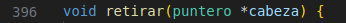

# Manual Técnico
Marjorie Gissell Reyes Franco - 202000560

Instalación de C
```
sudo apt-get build-essential
```
Compilar archivos
```
gcc main.c -o main
```
Ejecutar programa
```
./main
```

### Archivos de carga
Carga masiva "TRANSACCIONES"
* Formato:
operacion,cuenta1,cuenta2,monto
* Tipos de dato:
int,int,int,float
* Ejemplo:


Carga masiva "USUARIOS"
* Formato:
no_cuenta,nombre,saldo
* Tipos de dato:
int,char*,float
* Ejemplo:


### Estructuras
Estructura para manejar los argumentos de los hilos


Estructura para manejar los nodos de usuarios en la lista enlazada


Estructura para el manejo de las transacciones ingresadas en la carga masiva


Estructura para el manejo de usuarios


### Variables globales
* Manejo de puntero inicial de la lista enlazada de usuarios
```
typedef usuario *puntero;
puntero inicio = NULL; 
```
* Manejo de la lista de transacciones ingresadas en carga masiva
```
struct transacciones transacs[300];
int contador_transac = 0;
```
* Manejo de la lista de errores de la carga masiva de usuarios
```
struct Error_struct errores[100];
int contador_errores = 0;
```
* Manejo de la lista de errores de la carga masiva de transacciones
```
struct Error_struct errores2[100];
int contador_errores2 = 0;
```
* Manejo de contadores para saber la cantidad de operaciones realizadas
```
int contador_retiros = 0;
int contador_depositos = 0;
int contador_transferencia = 0;
```

### Funciones
Maneja el flujo de inicio, es decir, la carga masiva de usuarios por medio de la creación de 3 hilos.


Función propia de los hilos, se encarga de acceder a la línea actual del archivo para realizar lectura por filas, análisis y almacenamiento de datos.


Función para mostrar en consola el menu de opciones y su redirección a su respectiva funcionalidad.


Función que se encarga de la creación de 4 hilos y su asociación con sus respectivos argumentos y función.


Función propia de los hilos encargados de la carga masiva de transacciones, accede a la línea actual del archivo para realizar la lectura por filas y su almacenamiento.


Función encargada de analizar el formato de las transacciones, validar errores y funcionalidades específicas


Función para la operación individual de depositar, valida la existencia de la cuenta en la lista enlazada


Función para la operación individual de retirar, valida la existencia de la cuenta en la lista enlazada y que el saldo sea suficiente



Función para la operación individual de transferir, valida la existencia de las cuentas en la lista enlazada y que el saldo sea suficiente


Función para la operación individual de consultar, valida la existencia de la cuenta en la lista enlazada


Función para crear el reporte de estados de cuenta


Función para crear el reporte de carga masiva de usuarios


Función para crear el reporte de carga masiva de operaciones


Función para validar si una cuenta ya existe en el sistema


Función para validar si es un valor numérico o no


Función para insertar en la lista enlazada los registros de nuevos usuarios


